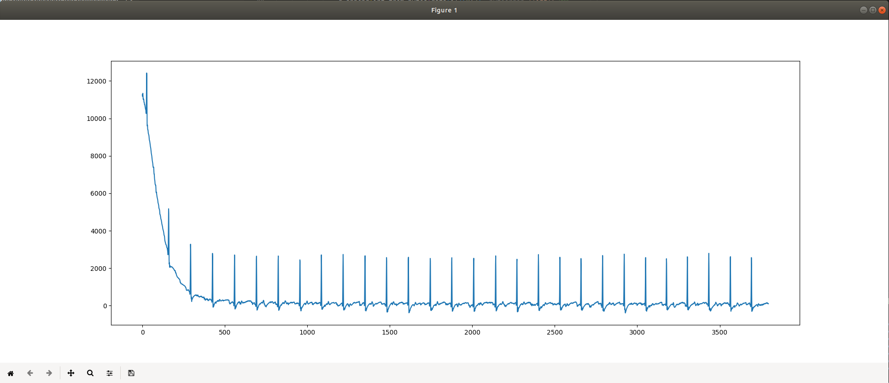

# Using python to analyze data
Using gatttool was good to find out how to get it going but now its time to put it into a tool and have a look at the data stream.

## First steps in python
After some playing around with different libraries I used "Bleak" to interface with the device.

https://bleak.readthedocs.io/en/latest

## Starting the stream and dumping the data
Piping the Bleak examples and my findings together

[My findings](../exploration/gatttool.md)

[Bleak notification example](https://github.com/hbldh/bleak/blob/master/examples/enable_notifications.py)

[Bleak device communication example](https://github.com/hbldh/bleak/blob/master/examples/philips_hue.py)

[Resulting python program](./ecg.py)

## Converting and visualizing data

[Enable ECG data stream and convert data](./ecg2.py)

[Sample data dump](./doc/ecg2_demo.txt) and its visualisation:


### Converting the data
The 3 byte data format is awful. But 14 bits fit into the first two bytes and therefore interpret the first two bytes as signed 16 bit integer and use some integrasted conversion functions to convert.
```python
def pmd_data_handler(characteristic: BleakGATTCharacteristic, data: bytearray):
    if data[0] == 0x00: # 0x00 = ECG
        i = 9
        frame_type = data[i]
        if frame_type == 0: # 0 = ECG Data
            i += 1
            while len(data[i:][0:3]) == 3:
                d.append(int.from_bytes(data[i:][0:2], byteorder='little', signed=True))
                i += 3
```
